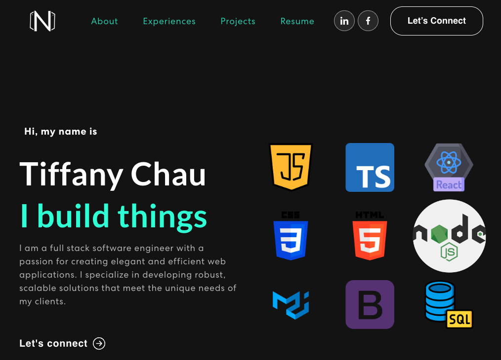

## 
tiffanychau.com -v1

 The first version of tiffanychau.com built with React 
 
 

 
 

## Installation & Set up

In the project directory, you can run:

### `npm install`

### `npm start`

Runs the app in the development mode.\
Open [http://localhost:3000](http://localhost:3000) to view it in your browser.

The page will reload when you make changes.

